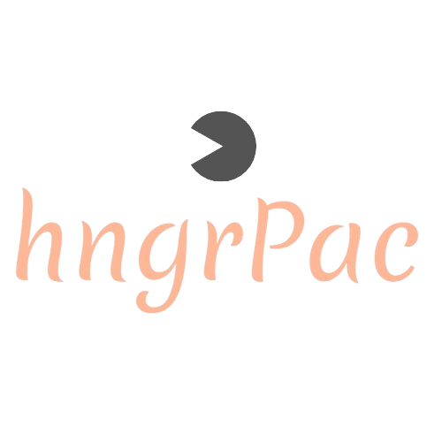

<div id="readme-top"></div>

<div align="center">
  <a href="https://github.com/othneildrew/Best-README-Template">
    
  </a>

  <p align="center">
    Satisfy Cravings Anytime
    <br />
    <a href="https://github.com/boyandmtrv/Huddle"><strong>Discover the docs</strong></a>
  </p>
</div>

<details>
  <summary>Table of Contents</summary>
  <ol>
    <li>
      <a href="#about-the-project">About The Project</a>
        <li><a href="#built-with">Built With</a></li>
    </li>
        <li><a href="#installation">Installation</a></li>
    <li><a href="#usage">Usage</a></li>
    <li><a href="#license">License</a></li>
    <li><a href="#contact">Contact</a></li>
  </ol>
</details>

## About The Project


hngrPac is your go-to recipe app for discovering delicious meals based on the ingredients in your fridge, the time period for your cooks, and different cuisine tastes. No need for authentication – just jump right in and explore the world of culinary delights!

Why hngrPac? <br />

hngrPac is focused on the needs of each person when wondering what to cook - time and ingredients. In the midst of busy schedules and varying pantry contents, making a delicious and satisfying meal can be a challenge, so there comes hngrPac, it streamlines the process by offering tailored recipe searches:
* Standard Search - easy find recipes by entering the ingredients you have on hand. hngrPac will provide you with a variety of recipes that match your ingredients.
* Search by Time - Short on time? No worries! Use the time-based search feature to filter recipes based on the ingredients in your fridge and the time available to cook.
* Search by Cuisine - Craving a specific cuisine? Explore different flavors by entering your available ingredients along with your desired cuisine.

Once you find a desired recipe, click on it to reveal a detailed description and a link to the full recipe. We want to make your cooking experience enjoyable and hassle-free.

<p align="right">(<a href="#readme-top">back to top</a>)</p>

### Built With
[](https://react.dev/) <br/>
[](https://reactrouter.com/) <br/>
[](https://github.com/axios/axios) <br/>
[](https://tailwindcss.com/) <br/>
[](https://developer.mozilla.org/en-US/docs/Web/CSS) <br />
[](https://react-icons.github.io/react-icons/) <br/>
[](https://fkhadra.github.io/react-toastify/) <br/>
[](https://vitejs.dev/) <br/>

<p align="right">(<a href="#readme-top">back to top</a>)</p>

## Getting Started

To get a local copy, follow these steps:
  
### Installation

1. Clone the repo
   ```sh
   git clone https://github.com/boyandmtrv/hngrPac.git
   ```
2. Install NPM packages in the fastbite's folder
   ```sh
   cd .\fastbite\
   ```
   ```sh
   npm install
   ```

<p align="right">(<a href="#readme-top">back to top</a>)</p>

## Usage

### Run the app
1. Open a new terminal and enter the fastbite's folder
   ```sh
    cd .\fastbite\
   ```
2. Run the application
   ```sh
   npm run dev
   ```
   *To open the application locally, enter the following url in the browser field: http://localhost:5173/ or use CTRL + left click in the terminal box*

You can also check out the live version of hngrPac by clicking [here](https://hungrpac.vercel.app/)


<p align="right">(<a href="#readme-top">back to top</a>)</p>

## License

Distributed under the MIT License. See `LICENSE` for more information.

<p align="right">(<a href="#readme-top">back to top</a>)</p>

## Contact

[](https://www.linkedin.com/in/boyan-dimitrov-4402b4179/) <br />
[](mailto:boyandimitrov1462@gmail.com) <br />
[](https://github.com/boyandmtrv) <br />


<p align="right">(<a href="#readme-top">back to top</a>)</p>


